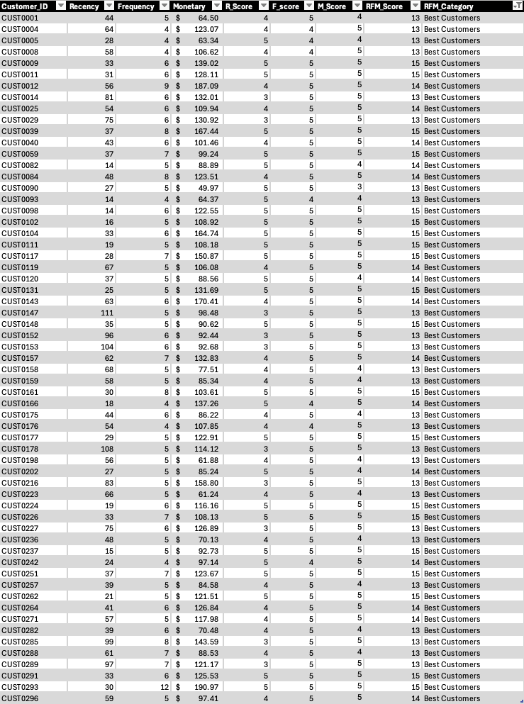
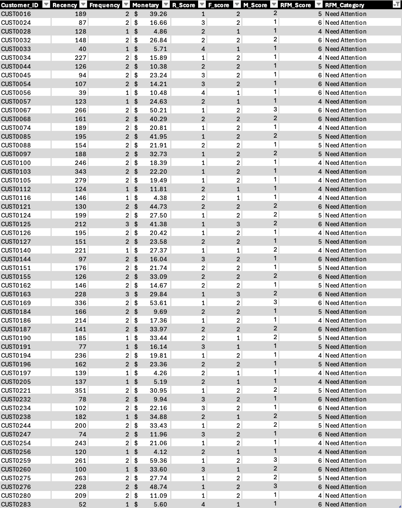
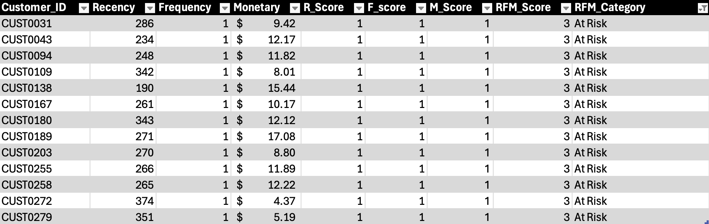

# 📊 PrintPlus Studios — RFM Customer Segmentation & Retention Analysis

*Turning one year of e-commerce order data into customer segments and actionable retention strategy*


## Table of Contents
- [Overview](#overview)
- [Business Questions](#business-questions)
- [Data Overview](#data-overview)
- [Methodology](#methodology)
- [Key Insights](#key-insights)
- [Recommendations](#recommendations)
- [Tools and Skills Demonstrated](#tools-and-skills-demonstrated)
- [Repository Contents](#repository-contents)
- [Contact](#contact)

---

## 📋 Overview

**PrintPlus Studios** is an e-commerce company, established in 2019, specialising in personalised print products — business cards, canvas prints, posters, flyers, photo books, and greeting cards — sold entirely online.

Like many growing e-commerce businesses, PrintPlus had a year's worth of order data that had never been systematically analysed. This project applies an **RFM (Recency, Frequency, Monetary) framework** in Excel to turn that raw transactional data into customer segments, uncovering who the business's most valuable customers are and where retention effort and marketing budget should — and shouldn't — be spent.

## 🎯 Business Questions

1. Who are PrintPlus Studios' best customers?
2. Which customers should be targeted with a retention campaign?
3. Which customers can be safely excluded from paid marketing campaigns?

---

## 🗂️ Data Overview

The dataset is one year of order-level transaction history: **1,000 orders** across roughly **287 unique customers**.

| Field | Description |
|---|---|
| `OrderID` | Unique identifier for each transaction |
| `CustomerID` | Identifies which customer placed the order |
| `OrderDate` | Date the order was placed |
| `ProductType` | Product category purchased |
| `OrderValue` | Order total, in USD ($) |r

**Quality checks performed before analysis:**
- ✅ Checked `OrderID` for duplicate values
- ✅ Checked `OrderDate`, `OrderValue`, and `CustomerID` for blanks or missing values
- ✅ Verified the earliest and latest transaction dates to confirm the analysis window

---

## 🧮 Methodology

RFM scores every customer on three dimensions, each ranked 1–5 against the full customer base using percentiles, then summed into one **RFM Score (3–15)**:

- **Recency (R)** — how recently did they last purchase?
- **Frequency (F)** — how often do they purchase?
- **Monetary (M)** — how much do they spend?

**Recency** is inverted, since a *lower* days-since-last-order is better:

| Percentile band (days since last order) | R Score |
|---|:---:|
| Bottom 20% (most recent) | 5 |
| 20th – 40th percentile | 4 |
| 40th – 60th percentile | 3 |
| 60th – 80th percentile | 2 |
| Top 20% (least recent) | 1 |

**Frequency and Monetary** score the same way, but higher is better:

| Percentile band | F / M Score |
|---|:---:|
| Top 20% | 5 |
| 60th – 80th percentile | 4 |
| 40th – 60th percentile | 3 |
| 20th – 40th percentile | 2 |
| Bottom 20% | 1 |

R, F, and M scores are summed into an **RFM Score**, which maps to five segments:

| RFM Score | Segment |
|---|---|
| 13 – 15 | 🏆 Best Customers |
| 10 – 12 | Loyal Customers |
| 7 – 9 | Potential Loyal Customers |
| 4 – 6 | ⚠️ Need Attention |
| 3 | 🔻 At Risk |

### Excel Formulas

**Days since last purchase (feeds the Recency column)**

```
=TODAY()-B4
```

**R_Score**

```
=IFS(B2<=PERCENTILE.INC($B$2:$B$288,0.2),5,B2<=PERCENTILE.INC($B$2:$B$288,0.4),4,B2<=PERCENTILE.INC($B$2:$B$288,0.6),3,B2<=PERCENTILE.INC($B$2:$B$288,0.8),2,TRUE,1)
```

**F_Score**

```
=IFS(C2>=PERCENTILE.INC($C$2:$C$288,0.8),5,C2>=PERCENTILE.INC($C$2:$C$288,0.6),4,C2>=PERCENTILE.INC($C$2:$C$288,0.4),3,C2>=PERCENTILE.INC($C$2:$C$288,0.2),2,TRUE,1)
```

**M_Score**

```
=IFS(D2>=PERCENTILE.INC($D$2:$D$288,0.8),5,D2>=PERCENTILE.INC($D$2:$D$288,0.6),4,D2>=PERCENTILE.INC($D$2:$D$288,0.4),3,D2>=PERCENTILE.INC($D$2:$D$288,0.2),2,TRUE,1)
```

**RFM_Score**

```
=E2+F2+G2
```

**RFM_Category**

```
=IFS(H2>=13,"Best Customers",H2>=10,"Loyal Customers",H2>=7,"Potential Loyal Customers",H2>=4,"Need Attention",TRUE,"At Risk")
```

📄 Full formula documentation: [Google Doc](https://docs.google.com/document/d/11wYtmhPXSS-ClJ5QhHnWWfoReHPZVQd5/edit?usp=sharing&ouid=102165638531054537510&rtpof=true&sd=true)

---

## 📊 Key Insights

The RFM analysis grouped customers into five segments. **61 Best Customers** form a strong top tier that drives the largest share of revenue, **57 customers** fall into **Need Attention** with clear signs of declining engagement, and a small group of **13** are **At Risk**, marked by long inactivity and minimal spend. The remaining ~156 customers sit in the Loyal and Potential Loyal Customers tiers between these extremes.

| Segment | Customers | Avg. Recency | Avg. Frequency | Avg. Monetary | Share of Revenue |
|---|:---:|:---:|:---:|:---:|:---:|
| 🏆 Best Customers | 61 | 48 days | ~6 orders/yr | $110.88 | ~39% |
| ⚠️ Need Attention | 57 | 170 days | ~2 orders/yr | $23.65 | ~8% |
| 🔻 At Risk | 13 | 284 days | ~1 order/yr | $10.67 | ~0.8% |

### 🏆 Best Customers — 61 customers · RFM Score ≥ 13

<p align="center">
 
</p>

PrintPlus Studios' most valuable customers — highly recent, highly frequent, and high-spending. This segment alone generates **~39% of total revenue**.

| Dimension | Average | Score Distribution |
|---|---|---|
| Recency | 48 days since last order | R=5: 46% · R=4: 38% · R=3: 16% |
| Frequency | ~6 orders/year | F=5: 89% · F=4: 11% |
| Monetary | $110.88 per customer | M=5: 74% · M=4: 25% · M=3: 5% |

**Recency** — 46% (28 customers) in this segment made purchases more recently than 80% of the entire customer base. 38% (23 customers) purchased more recently than 60% of customers, and 16% (10 customers) purchased more recently than 40% of customers. The best customer segment is composed largely of highly recent purchasers.

**Frequency** — 89% (54 customers) in this segment made purchases more frequently than 80% of the customer base, while the remaining 11% (7 customers) purchased more frequently than 60% of customers. The entire best customer segment consistently falls within the highest-frequency tiers.

**Monetary** — 74% (45 customers) in this segment spend more than 80% of all customers, 25% (15 customers) spend more than 60% of customers, and 5% (1 customer) spend more than 40% of customers. The best customer segment is largely composed of high-value spenders who generate a significant share of overall revenue.


### ⚠️ Need Attention — 57 customers · RFM Score 4–6

<p align="center">
 
</p>

The largest segment after Best Customers, with recency, frequency, and spend all trending downward. This is the clearest candidate group for reactivation before they churn entirely.

| Dimension | Average | Score Distribution |
|---|---|---|
| Recency | 170 days since last order | R=4: 5% · R=3: 16% · R=2: 37% · R=1: 43% |
| Frequency | ~2 orders/year | F=3: 4% · F=2: 70% · F=1: 26% |
| Monetary | $23.65 per customer | M=3: 7% · M=2: 32% · M=1: 61% |

**Recency** — 5% (3 customers) in this segment purchased more recently than 60% of the customer base, 16% (9 customers) purchased more recently than 40% of customers, 37% (21 customers) purchased more recently than 20% of customers, and 43% (24 customers) purchased less recently than 80% of customers, placing them in the bottom 20% for recency. The need attention segment is characterised by a substantial share of customers whose last purchase occurred a significant time ago, indicating declining engagement and an elevated risk of churn.

**Frequency** — 4% (2 customers) purchase more frequently than 40% of the customer base, 70% (40 customers) purchase more frequently than 20% of customers, and 26% (15 customers) purchase less frequently than 80% of customers, placing them in the bottom 20% for purchase frequency. The need attention segment is dominated by customers with low purchase frequency, indicating limited repeat-buying behaviour and weaker purchasing consistency.

**Monetary** — 7% (4 customers) in this segment spend more than 40% of the customer base, 32% (18 customers) spend more than 20% of customers, and 61% (35 customers) spend less than 80% of customers, placing them in the bottom 20% for total spending. The need attention segment is predominantly composed of low-spending customers with limited revenue contribution.


### 🔻 At Risk — 13 customers · RFM Score = 3

<p align="center">
 
</p>

The smallest and lowest-engagement segment — every customer here scores the minimum on all three dimensions.

| Dimension | Average | Score Distribution |
|---|---|---|
| Recency | 284 days since last order | R=1: 100% |
| Frequency | ~1 order/year | F=1: 100% |
| Monetary | $10.67 per customer | M=1: 100% |


**Recency** — 100% (13 customers) in this segment purchased less recently than 80% of the customer base, placing all of them in the bottom 20% for recency. The at risk segment has been inactive for a long period and shows a high likelihood of disengagement.

**Frequency** — 100% (13 customers) in this segment purchase less frequently than 80% of the customer base, placing them in the bottom 20% for purchase frequency. The at risk segment reflects consistently low repeat-buying behaviour, signalling weak loyalty and limited interaction with the business.

**Monetary** — 100% (13 customers) in this segment spend less than 80% of the customer base, placing them in the bottom 20% for total spending. The at risk segment contributes the lowest revenue levels in the dataset.


---

## 💡 Recommendations

| Segment | Recommended Action | Why |
|---|---|---|
| 🏆 Best Customers | Launch a **VIP loyalty programme** — priority printing, premium templates, exclusive perks | Already drives ~39% of revenue; strong repeat-purchase behaviour makes further investment highly profitable |
| ⚠️ Need Attention | Run a **targeted re-engagement campaign** (e.g. 10% off or free shipping, time-limited) | Still purchases ~2×/year on average — a realistic, relatively low-cost group to win back |
| 🔻 At Risk | **Exclude from paid marketing campaigns** | Contributes <1% of revenue with minimal reactivation likelihood; excluding them frees up budget for profitable segments |

---

## 🛠️ Tools and Skills Demonstrated

- **Microsoft Excel** — `IFS()`, `PERCENTILE.INC()`, `TODAY()`, and nested logical formulas
- **RFM segmentation** — translating raw transactional data into customer value tiers
- **Data quality checks** — duplicate detection, blank/missing-value checks, date-range validation
- **Customer analytics** — recency, frequency, and monetary distribution analysis by segment
- **Business storytelling** — turning statistical segments into concrete, actionable marketing recommendations

---

## 📁 Repository Contents

- 📊 [Excel workbook](./ExcelWorkbook_PrintShopOrders.xlsx) — raw transaction data, RFM scoring, and summary tables
- 📄 [Formula reference document](https://docs.google.com/document/d/11wYtmhPXSS-ClJ5QhHnWWfoReHPZVQd5/edit?usp=sharing&ouid=102165638531054537510&rtpof=true&sd=true) — every formula used in this analysis
- 🖼️ [assets](./assets) — segment screenshots used in this README (`best-customers.png`, `need-attention.png`, `at-risk.png`)
- 📝 This README

---
